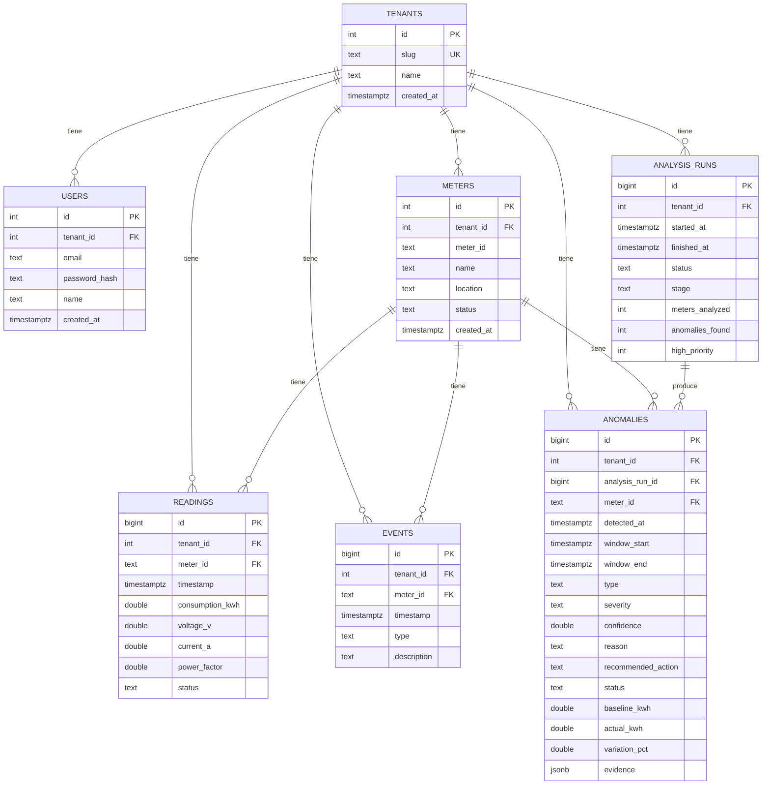

# AI Energy Management Platform

MVP para gestionar medidores eléctricos y usar IA (detección estadística +
explicación) para detectar, priorizar y recomendar acciones sobre anomalías.
Prueba técnica: Backend + Frontend + Data + IA.

## Estado actual

Repo en construcción, paso a paso. **El backend ya está completo y
funcional de punta a punta**; lo que falta es el frontend:

- `backend/` — módulo Go (`energy-platform`), Postgres con `sqlc` (SQL
  explícito + código Go generado, sin ORM), migraciones para el schema
  completo del ERD, y un seed que carga `readings.csv`/`events.csv` al
  arrancar (idempotente). Login (`POST /auth/login`, `GET /auth/me`) con
  JWT. `GET /meters`, `/meters/:id`, `/meters/:id/readings`,
  `/dashboard/summary` con datos reales. Motor de detección +
  clasificación + explicación (`internal/analytics` + `internal/ai`),
  orquestado por `internal/anomalies` y expuesto en
  `POST /ai/analyze`, `GET /ai/analysis/:id`, `GET /anomalies`,
  `GET /anomalies/:id`. `GET /health`.
  Corrido de punta a punta contra el dataset real: 12 medidores
  analizados, 4 anomalías detectadas, 2 de alta prioridad — coincide
  exacto con el ejemplo del enunciado (sección 13). Las 4 explicaciones
  las escribió un LLM real (OpenAI), citando los números correctos.
- `frontend/` — Vite + React + TypeScript + Tailwind CSS v4. Redux
  Toolkit + RTK Query para estado/data-fetching, Axios por debajo (con
  interceptors: token automático en cada request, logout global en
  cualquier 401). Login funcional contra el backend real, rutas
  protegidas (`react-router-dom`), shell con nav. Marca propia ("Voltra"),
  paleta (`brand`/`ink`) y tipografía (Geist Sans) definidas como tokens
  de Tailwind v4. Dashboard (KPIs + hero de la anomalía top-prioridad +
  lista), Medidores (tabla con filtros, cruzando medidores con anomalías
  del lado del cliente) y Detalle de medidor (stat tiles + gráfico de
  consumo diario) ya usan datos reales de la API, no mock. Anomalías IA
  sigue siendo placeholder.
- `data/` — `readings.csv` (4.032 lecturas, 12 medidores, 14 días) y
  `events.csv` (eventos operativos conocidos) provistos por la prueba.
- `docker-compose.local.yaml` + `run.sh` — levanta Postgres, backend y
  frontend en modo dev.

Pendiente: Anomalías IA → Investigación → Acción (botón "Run AI
Analysis", lista completa, vista de investigación con evidencia).

## Cómo se pensó esto

El objetivo no es un CRUD de medidores, es mostrar el ciclo completo: datos
→ análisis → anomalía → explicación → priorización → acción. Eso terminó
condicionando casi todas las decisiones de abajo.

Para el backend elegí Go + Postgres. El dataset es relacional de manera
bastante directa (medidores → lecturas → eventos → anomalías), y con un
campo `JSONB` para la evidencia de cada anomalía no hace falta modelar una
tabla nueva por cada tipo de dato que cambia según el caso (z-scores,
voltaje/PF, timestamps flageados, evento relacionado).

Para hablar con la base no uso un ORM — en Go no es tan común como en otros
lenguajes, y para el motor de detección (agregaciones, baseline por hora,
JSONB) quería control fino sobre el SQL. Uso `sqlc`: escribo el SQL a mano
en archivos `.sql`, y genera funciones Go tipadas a partir de eso. Si
cambio una columna en una migración y una query deja de ser válida, me
entero al generar el código, no en producción.

La parte de IA la separé en dos capas que no se pisan. La detección y
clasificación — ¿hay anomalía?, de qué tipo, qué tan severa, con qué
confianza — es puramente estadística: baseline por hora del día calculado
sobre los primeros 7 días, z-score para spikes sostenidos de consumo, y un
chequeo de voltaje/power-factor para distinguir falla de sensor de cambio
real de consumo. Esa parte nunca toca un LLM porque necesito que sea
reproducible: los casos que evalúa la prueba (detectar M-109, no tratar
M-106 como anomalía real, marcar M-112 como calidad de datos) no pueden
depender de que un modelo responda distinto en cada corrida. Donde sí entra
un LLM (OpenAI) es para redactar el `reason` y el `recommended_action` — le
paso la evidencia ya calculada y le pido que la narre, no que diagnostique.
Si no hay `OPENAI_API_KEY` o falla la llamada, cae a una explicación armada
con template, para que el demo no se rompa por un tema de red o de costo.
El fallback no es teórico: los tests de `internal/ai` levantan un servidor
HTTP falso y verifican que ante un 401, una respuesta sin JSON válido, o
sin API key configurada, siempre vuelve algo usable — y por separado hay
un test con build tag `live` (no corre en la suite normal) que sí pega
contra la API real de OpenAI, para confirmar que el prompt y el parseo
funcionan con la API de verdad, no solo con el mock.

Separar "falla de sensor" de "cambio real de consumo" no salió a la primera.
Mi primer intento marcaba calidad de datos con un z-score de voltaje/PF
contra la media histórica del medidor — y eso también disparaba para M-109,
cuyo power factor cae de ~0.95 a ~0.74 cuando sube el consumo (un cambio
real, no un sensor roto). La señal que sí separa los dos casos es la
continuidad: M-109 tiene un bloque de 58 horas seguidas sin un solo hueco,
mismo signo y magnitud todo el tiempo (un cambio de estado sostenido);
M-112 tiene 16 lecturas sueltas cada 3 horas exactas, alternando de signo y
magnitud entre sí (ruido de sensor intermitente, no un estado nuevo). Ahora
el motor agrupa las lecturas fuera de rango en bloques contiguos: un bloque
largo se trata como evidencia de una anomalía real; lecturas aisladas y
dispersas se marcan como calidad de datos. Queda como test en
`internal/analytics/detector_test.go` y `internal/ai/classifier_test.go`,
corriendo contra el CSV real — los 4 casos del dataset (M-104/106/109/112)
más los 8 medidores sin anomalía, para no perder de vista falsos positivos.

Cada racha de consumo también queda etiquetada con dos datos extra, baratos
de calcular con lo que ya teníamos: si sigue activa (`Ongoing`, el bloque
llega hasta la última lectura del dataset) o ya se resolvió sola, y si el
cambio fue abrupto (`STEP`, la desviación ya está casi completa en la
primera lectura fuera de rango) o gradual (`GRADUAL`, tarda varias horas en
llegar a su punto máximo). Esto separa dos categorías que el enunciado pide
distinguir (sección 8: "spikes/cambios bruscos" vs "cambios persistentes")
y que hasta ahora tratábamos igual — y le da más sustancia al `reason` que
va a redactar el LLM en la pieza 5 ("subió 110% de forma abrupta y sigue
así 2 días después" en vez de solo "subió 110%").

`POST /ai/analyze` corre todo el pipeline de forma síncrona — para 12
medidores el motor estadístico es instantáneo, y lo único que tarda es el
LLM. En vez de llamarlo una anomalía a la vez (que con 4 anomalías serían
~12-15s en serie), las explicaciones salen en paralelo con goroutines, así
que la corrida completa (detección + clasificación + 4 llamadas a OpenAI)
tarda ~3s. No armé infraestructura de polling/estado-en-progreso porque acá
no hace falta — para un dataset que creciera a cientos de medidores sí
tendría sentido, pero no para este. `GET /anomalies` devuelve solo las
anomalías del último análisis corrido (no las de cada click acumulado) —
correrlo de nuevo reemplaza lo que se muestra, no lo duplica.

Encontré el mismo bug del offset de timezone (pgx decodificando con
`time.Local`) por segunda vez, esta vez escondido dentro del JSON de
`evidence` (`related_event.timestamp` salía con offset de mi máquina en
vez de `Z`) — se me había colado porque ese campo se serializa en memoria
antes de tocar `httpx.FormatTime`, que es donde estaba el fix la primera
vez. Ahora se fuerza `.UTC()` apenas se leen los timestamps desde la base,
en el punto de conversión, no en cada lugar donde se despliegan.

Frontend: React + Vite + TypeScript + Tailwind, buscando que se sienta como
un producto real y no como pantallas de prueba, sin perder velocidad de
desarrollo en el camino. El manejo de estado/data-fetching es Redux
Toolkit + RTK Query, con Axios por debajo en vez de `fetch` — así los
interceptors quedan en un solo lugar: uno de request que le pega el token
a cada llamada, y uno de response que ante cualquier 401 limpia la sesión
globalmente, sin que cada pantalla tenga que acordarse de manejarlo. Para
evitar un import circular (el store necesita a Axios vía RTK Query, y si
Axios necesitara al store para hacer logout en el 401 se cierra el
círculo), el interceptor no importa el store directo — avisa a través de
un pub/sub chico (`api/authEvents.ts`), y es el store el que se suscribe
una vez, al crearse.

Le puse nombre e identidad propia al producto — "Voltra" — en vez de
dejarlo como "AI Energy Management" genérico en toda la UI. La paleta
(`brand` teal + `ink` navy) y la tipografía (Geist Sans, self-hosted para
no depender de una CDN externa durante la demo) están como tokens de
Tailwind v4 en `index.css`, no como hex sueltos copiados en cada
componente. El login tiene un panel de marca a la izquierda con el
propósito del producto en criollo, sin mencionar que esto es una prueba
técnica — la idea es que se sienta como el login de un SaaS real, no como
una pantalla de demo.

El gráfico de consumo (Detalle de medidor) es un `LineChart` propio en SVG
puro, sin librería — línea de 2px con extremos redondeados, crosshair que
sigue el mouse y tooltip, sin depender de color solo para leer el valor
(el tooltip siempre trae el número). La tabla de Medidores cruza dos
respuestas de la API del lado del cliente (`/meters` + `/anomalies`) para
armar las columnas "Estado" y "Anomalía" del enunciado (sección 6), que
usan vocabularios distintos — Estado es OK/Alert/Critical, Anomalía es la
severidad HIGH/MEDIUM/LOW — en vez de agregar un endpoint nuevo solo para
eso.

Mientras conectaba el Dashboard encontré otro bug real: `/dashboard/summary`
contaba anomalías de *todos* los análisis corridos históricamente, no solo
el último — cada click en "Run AI Analysis" sumaba de nuevo en vez de
reemplazar. Quedó igual que `/anomalies`: escopeado al último
`analysis_run` completado.

Para el login usé JWT con un solo usuario demo seedeado. Cubre el flujo
Login → Dashboard sin construir un sistema de registro/roles que nadie va a
usar en una demo de 10 minutos.

Una que nadie pidió: le metí `tenant_id` a todas las tablas desde el modelo
de datos, aunque hoy el producto opera con un único tenant seedeado y no
hay UI para crear o cambiar de tenant. Es una decisión de esquema, no de
producto — separar por tenant después de tener datos mezclados es una
migración fea, y hacerlo desde el día uno no cuesta nada.

Y todo el stack levanta con `./run.sh local` — lo único que necesita quien
evalúe esto es tener Docker corriendo.

**Lo que queda afuera, a propósito:**

- UI multi-tenant (alta/cambio de tenant) — el esquema lo soporta, el
  producto no lo expone.
- Tiempo real — el análisis se dispara a mano con "Run AI Analysis", no hay
  websockets ni polling agresivo.
- Modelos entrenados — la detección es estadística explicable, no una caja
  negra.
- Tests end-to-end o CI/CD — la cobertura se concentra en el motor de
  detección/clasificación, que es lo que evalúa la prueba.

## Modelo de datos



Todas las tablas cuelgan de `TENANTS` vía `tenant_id`, incluida `USERS`
(cada usuario pertenece a un tenant). `meter_id` es único por tenant
(`UNIQUE(tenant_id, meter_id)` en `METERS`), y `READINGS`/`EVENTS`/
`ANOMALIES` referencian al medidor por `(tenant_id, meter_id)` para que un
`tenant_id` inconsistente entre una lectura y su medidor sea imposible a
nivel de base de datos. `evidence` en `ANOMALIES` es JSONB porque su forma
varía según el tipo de anomalía (z-scores, voltaje/PF baseline vs actual,
evento relacionado, timestamps flageados) — alimenta la pantalla de
Investigación sin modelar una tabla nueva por cada tipo de evidencia.

## Estructura

```
.
├── backend/                 # Go
│   ├── cmd/server/main.go
│   ├── internal/
│   │   ├── ai/              # clasificación por reglas + explicación (template/OpenAI)
│   │   ├── analytics/       # baseline por hora, z-score, calidad de datos
│   │   ├── anomalies/       # orquesta analytics+ai, /ai/analyze, /ai/analysis/:id, /anomalies
│   │   ├── auth/            # password hashing, JWT, middleware, /auth/login y /auth/me
│   │   ├── config/
│   │   ├── db/
│   │   │   ├── migrations/  # SQL crudo, fuente de verdad del schema
│   │   │   ├── queries/     # .sql que lee sqlc
│   │   │   └── sqlc/        # código Go generado (comiteado)
│   │   ├── dashboard/       # GET /dashboard/summary
│   │   ├── httpx/           # helpers HTTP compartidos (JSON, formato de fecha)
│   │   ├── httpserver/      # router + CORS, arma todas las rutas
│   │   ├── meters/          # GET /meters, /meters/:id, /meters/:id/readings
│   │   └── seed/            # tenant + usuario demo + carga de readings/events.csv
│   ├── sqlc.yaml
│   ├── Dockerfile
│   └── go.mod
├── frontend/                 # Vite + React + TS + Tailwind
│   ├── src/
│   │   ├── api/              # axios + interceptors, RTK Query (apiSlice.ts)
│   │   ├── auth/              # ProtectedRoute (guard de rutas)
│   │   ├── components/       # LineChart, Sparkline, StatTile, Badge
│   │   ├── layout/            # shell con nav + logout
│   │   ├── pages/              # Login, Dashboard, Medidores, Detalle (Anomalías: placeholder)
│   │   └── store/              # Redux: authSlice + store.ts
│   └── Dockerfile
├── data/
│   ├── readings.csv
│   └── events.csv
├── docker-compose.local.yaml
└── run.sh
```

## Cómo correr (local, con Docker)

```bash
./run.sh local
```

Esto levanta:

- **backend** — Go, `go run ./cmd/server`, puerto `8080` (`GET /health`)
- **frontend** — Vite dev server, puerto `5173`
- **db** — Postgres 16, puerto host `5433` (usuario/clave/db: `app`/`app`/`energy`)

## Variables de entorno (backend)

| Variable        | Default                                                    |
|-----------------|-------------------------------------------------------------|
| `PORT`          | `8080`                                                       |
| `DATABASE_DSN`  | `postgres://app:app@db:5432/energy?sslmode=disable` (en Docker) |
| `DATA_DIR`      | `../data` — carpeta con `readings.csv`/`events.csv` para el seed |
| `JWT_SECRET`    | `dev-secret-change-me` — cambiar en cualquier entorno real |
| `OPENAI_API_KEY` | (sin default) — si no está seteada, las explicaciones de anomalías caen a template en vez de LLM |

**Usuario demo seedeado:** `admin@energy-platform.local` / `demo1234`
(un solo tenant, un solo usuario — ver [Alcance de diseño](#cómo-se-pensó-esto)).

**Probar el explainer de OpenAI contra la API real** (no corre en
`go test ./...` normal, hay que pedirlo explícitamente para no gastar
créditos en cada corrida):

```bash
cd backend
echo "OPENAI_API_KEY=sk-..." > .env.local   # gitignored
go test ./internal/ai/... -tags=live -run TestLive_OpenAIExplainer_RealCall -v
```
