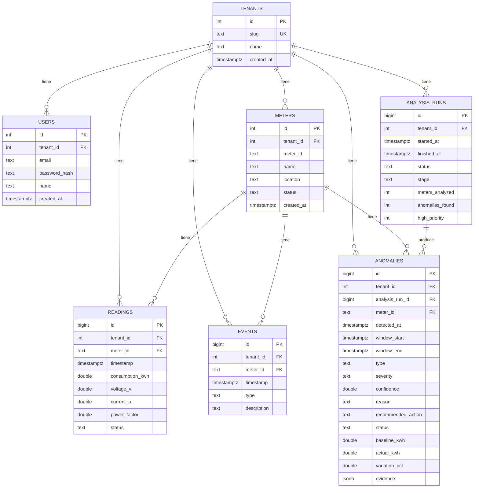

# AI Energy Management Platform

MVP para gestionar medidores eléctricos y usar IA (detección estadística +
explicación) para detectar, priorizar y recomendar acciones sobre anomalías.
Prueba técnica: Backend + Frontend + Data + IA.

## Estado actual

Repo en construcción, paso a paso. Por ahora hay **scaffolding** funcional,
sin lógica de negocio todavía:

- `backend/` — módulo Go (`energy-platform`), Postgres con `sqlc` (SQL
  explícito + código Go generado, sin ORM), migraciones para el schema
  completo del ERD, y un seed que carga `readings.csv`/`events.csv` al
  arrancar (idempotente: si ya hay datos, no vuelve a insertar). Login
  (`POST /auth/login`, `GET /auth/me`) con JWT y middleware que protege
  rutas. `GET /health`. Todavía sin motor de anomalías ni el resto de la
  API de negocio.
- `frontend/` — Vite + React + TypeScript + Tailwind CSS v4, con la página
  por defecto limpiada. Sin rutas ni pantallas del producto todavía.
- `data/` — `readings.csv` (4.032 lecturas, 12 medidores, 14 días) y
  `events.csv` (eventos operativos conocidos) provistos por la prueba.
- `docker-compose.local.yaml` + `run.sh` — levanta Postgres, backend y
  frontend en modo dev.

Pendiente: motor de detección de anomalías (baseline/z-score/calidad de
datos), clasificación y explicación por IA, API REST de negocio, y las
pantallas de Dashboard → Medidores → Detalle →
Anomalías IA → Investigación → Acción.

## Cómo se pensó esto

El objetivo no es un CRUD de medidores, es mostrar el ciclo completo: datos
→ análisis → anomalía → explicación → priorización → acción. Eso terminó
condicionando casi todas las decisiones de abajo.

Para el backend elegí Go + Postgres. El dataset es relacional de manera
bastante directa (medidores → lecturas → eventos → anomalías), y con un
campo `JSONB` para la evidencia de cada anomalía no hace falta modelar una
tabla nueva por cada tipo de dato que cambia según el caso (z-scores,
voltaje/PF, timestamps flageados, evento relacionado).

Para hablar con la base no uso un ORM — en Go no es tan común como en otros
lenguajes, y para el motor de detección (agregaciones, baseline por hora,
JSONB) quería control fino sobre el SQL. Uso `sqlc`: escribo el SQL a mano
en archivos `.sql`, y genera funciones Go tipadas a partir de eso. Si
cambio una columna en una migración y una query deja de ser válida, me
entero al generar el código, no en producción.

La parte de IA la separé en dos capas que no se pisan. La detección y
clasificación — ¿hay anomalía?, de qué tipo, qué tan severa, con qué
confianza — es puramente estadística: baseline por hora del día calculado
sobre los primeros 7 días, z-score para spikes sostenidos de consumo, y un
chequeo de voltaje/power-factor para distinguir falla de sensor de cambio
real de consumo. Esa parte nunca toca un LLM porque necesito que sea
reproducible: los casos que evalúa la prueba (detectar M-109, no tratar
M-106 como anomalía real, marcar M-112 como calidad de datos) no pueden
depender de que un modelo responda distinto en cada corrida. Donde sí entra
un LLM (OpenAI) es para redactar el `reason` y el `recommended_action` — le
paso la evidencia ya calculada y le pido que la narre, no que diagnostique.
Si no hay `OPENAI_API_KEY` o falla la llamada, cae a una explicación armada
con template, para que el demo no se rompa por un tema de red o de costo.

Frontend: React + Vite + TypeScript + Tailwind, buscando que se sienta como
un producto real y no como pantallas de prueba, sin perder velocidad de
desarrollo en el camino.

Para el login usé JWT con un solo usuario demo seedeado. Cubre el flujo
Login → Dashboard sin construir un sistema de registro/roles que nadie va a
usar en una demo de 10 minutos.

Una que nadie pidió: le metí `tenant_id` a todas las tablas desde el modelo
de datos, aunque hoy el producto opera con un único tenant seedeado y no
hay UI para crear o cambiar de tenant. Es una decisión de esquema, no de
producto — separar por tenant después de tener datos mezclados es una
migración fea, y hacerlo desde el día uno no cuesta nada.

Y todo el stack levanta con `./run.sh local` — lo único que necesita quien
evalúe esto es tener Docker corriendo.

**Lo que queda afuera, a propósito:**

- UI multi-tenant (alta/cambio de tenant) — el esquema lo soporta, el
  producto no lo expone.
- Tiempo real — el análisis se dispara a mano con "Run AI Analysis", no hay
  websockets ni polling agresivo.
- Modelos entrenados — la detección es estadística explicable, no una caja
  negra.
- Tests end-to-end o CI/CD — la cobertura se concentra en el motor de
  detección/clasificación, que es lo que evalúa la prueba.

## Modelo de datos



Todas las tablas cuelgan de `TENANTS` vía `tenant_id`, incluida `USERS`
(cada usuario pertenece a un tenant). `meter_id` es único por tenant
(`UNIQUE(tenant_id, meter_id)` en `METERS`), y `READINGS`/`EVENTS`/
`ANOMALIES` referencian al medidor por `(tenant_id, meter_id)` para que un
`tenant_id` inconsistente entre una lectura y su medidor sea imposible a
nivel de base de datos. `evidence` en `ANOMALIES` es JSONB porque su forma
varía según el tipo de anomalía (z-scores, voltaje/PF baseline vs actual,
evento relacionado, timestamps flageados) — alimenta la pantalla de
Investigación sin modelar una tabla nueva por cada tipo de evidencia.

## Estructura

```
.
├── backend/                 # Go
│   ├── cmd/server/main.go
│   ├── internal/
│   │   ├── auth/            # password hashing, JWT, middleware, /auth/login y /auth/me
│   │   ├── config/
│   │   ├── db/
│   │   │   ├── migrations/  # SQL crudo, fuente de verdad del schema
│   │   │   ├── queries/     # .sql que lee sqlc
│   │   │   └── sqlc/        # código Go generado (comiteado)
│   │   ├── httpserver/      # router + CORS, arma todas las rutas
│   │   └── seed/            # tenant + usuario demo + carga de readings/events.csv
│   ├── sqlc.yaml
│   ├── Dockerfile
│   └── go.mod
├── frontend/                 # Vite + React + TS + Tailwind
│   └── Dockerfile
├── data/
│   ├── readings.csv
│   └── events.csv
├── docker-compose.local.yaml
└── run.sh
```

## Cómo correr (local, con Docker)

```bash
./run.sh local
```

Esto levanta:

- **backend** — Go, `go run ./cmd/server`, puerto `8080` (`GET /health`)
- **frontend** — Vite dev server, puerto `5173`
- **db** — Postgres 16, puerto host `5433` (usuario/clave/db: `app`/`app`/`energy`)

## Variables de entorno (backend)

| Variable        | Default                                                    |
|-----------------|-------------------------------------------------------------|
| `PORT`          | `8080`                                                       |
| `DATABASE_DSN`  | `postgres://app:app@db:5432/energy?sslmode=disable` (en Docker) |
| `DATA_DIR`      | `../data` — carpeta con `readings.csv`/`events.csv` para el seed |
| `JWT_SECRET`    | `dev-secret-change-me` — cambiar en cualquier entorno real |
| `OPENAI_API_KEY` | (sin default) — si no está seteada, las explicaciones de anomalías caen a template en vez de LLM |

**Usuario demo seedeado:** `admin@energy-platform.local` / `demo1234`
(un solo tenant, un solo usuario — ver [Alcance de diseño](#cómo-se-pensó-esto)).
