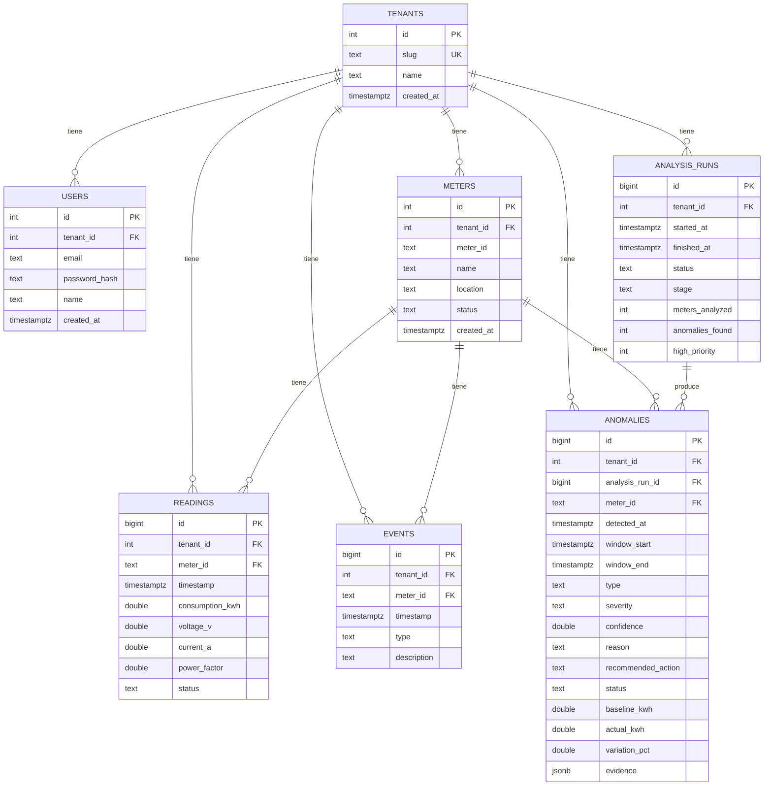

# AI Energy Management Platform

MVP para gestionar medidores eléctricos y usar IA (detección estadística +
explicación) para detectar, priorizar y recomendar acciones sobre anomalías.
Prueba técnica: Backend + Frontend + Data + IA.

**Demo en vivo:** https://frontend-production-6cbb.up.railway.app
(`admin@energy-platform.local` / `demo1234`). Desplegado en Railway,
build automático desde la rama `develop` en cada push.

## Cómo correr esto

Requisito único: tener Docker en ejecución.

```bash
git clone <este repo>
cd bia-test
cp .env.example .env   # opcional, ver nota abajo
./run.sh local
```

Este comando levanta el backend (`:8080`), el frontend (`:5173`) y
Postgres, con el dataset ya cargado. El paso de `.env` es opcional: sin
`OPENAI_API_KEY`, las explicaciones de anomalías se generan igual, pero
con un template en lugar de un LLM real (más detalle en
[Cómo se pensó esto](#cómo-se-pensó-esto)). Una vez finalizado:

1. Abrir **http://localhost:5173**
2. Iniciar sesión con `admin@energy-platform.local` / `demo1234`
3. Recorrer Dashboard → Medidores → seleccionar **M-109** → Anomalías IA
   → "Run AI Analysis" → Investigación de M-109

El detalle de variables de entorno está en la sección
[Detalle de cómo correrlo](#detalle-de-cómo-correrlo).

## Estado actual

**El ciclo completo está funcionando de punta a punta**: Login →
Dashboard → Medidores → Detalle → Anomalías IA → Investigación → Acción,
todo contra datos reales.

- `backend/` — módulo Go (`energy-platform`), Postgres con `sqlc` (SQL
  explícito + código Go generado, sin ORM), migraciones para el schema
  completo del ERD, y un seed que carga `readings.csv`/`events.csv` al
  arrancar (idempotente). Login (`POST /auth/login`, `GET /auth/me`,
  `POST /auth/logout`) con JWT en cookie `httpOnly` (no en el body ni en
  localStorage). `GET /meters`, `/meters/:id`, `/meters/:id/readings`
  (paginado por cursor), `/meters/daily`, `/meters/:id/daily`,
  `/dashboard/summary`. Motor de detección + clasificación + explicación
  (`internal/analytics` + `internal/ai`), orquestado por
  `internal/anomalies` (análisis por medidor en paralelo, acotado) y
  expuesto en `POST /ai/analyze`, `GET /ai/analysis/:id`,
  `GET /anomalies`, `GET /anomalies/:id`, `PATCH /anomalies/:id` (marcar
  en revisión / descartar). Timeout por request, errores reales logueados
  server-side. `GET /health`. Corrido de punta a punta contra el dataset
  real: 12 medidores analizados, 4 anomalías detectadas, 2 de alta
  prioridad — coincide exacto con el ejemplo del enunciado (sección 13).
  Las explicaciones las escribió un LLM real (OpenAI), citando los
  números correctos.
- `frontend/` — Vite + React + TypeScript + Tailwind CSS v4. Redux
  Toolkit + RTK Query para estado/data-fetching, Axios por debajo
  (`withCredentials`, logout global en cualquier 401). Login funcional
  contra el backend real, rutas protegidas (`react-router-dom`), shell
  con sidebar en desktop y barra de navegación inferior en mobile. Marca
  propia ("Voltra"), paleta (`brand`/`ink`) y tipografía (Geist Sans)
  definidas como tokens de Tailwind v4. Gráficos con Recharts (línea de
  tiempo por medidor, comparación real vs baseline con la ventana de la
  anomalía resaltada, voltaje/factor de potencia). Dashboard, Medidores,
  Detalle de medidor, Anomalías IA (con el botón "Run AI Analysis") e
  Investigación (evidencia, variables que cambiaron, comparación vs
  baseline, acciones reales) usan datos reales de la API, no mock.
  `ErrorBoundary` global y estados de carga con skeletons en vez de texto
  plano.
- `data/` — `readings.csv` (4.032 lecturas, 12 medidores, 14 días) y
  `events.csv` (eventos operativos conocidos) provistos por la prueba.
- `docker-compose.local.yaml` + `run.sh` — levanta Postgres, backend y
  frontend en modo dev.

Los 4 casos que evalúa la prueba (M-104/106/109/112) fueron verificados
contra el resultado real de `POST /ai/analyze`, no solo inspeccionados
manualmente.

## Cómo se pensó esto

El objetivo no es un CRUD de medidores, sino demostrar el ciclo completo:
datos → análisis → anomalía → explicación → priorización → acción.

**Backend en Go y Postgres, sin ORM.** Se utiliza `sqlc`: las consultas SQL
se escriben a mano y se genera código Go tipado a partir de ellas — si una
migración invalida una consulta, el error aparece al generar el código, no
en producción. La columna `evidence` de `ANOMALIES` es de tipo JSONB
porque su estructura varía según el tipo de anomalía, evitando modelar una
tabla nueva por cada caso.

**La inteligencia artificial está separada en dos capas independientes.**
La detección y clasificación (si hay una anomalía, de qué tipo y con qué
confianza) es puramente estadística — baseline horario sobre los primeros
7 días, z-score, verificación de voltaje y factor de potencia — para
garantizar resultados reproducibles: los casos que evalúa la prueba no
pueden depender de que un LLM responda de forma distinta en cada corrida.
El LLM (OpenAI) interviene únicamente para redactar `reason` y
`recommended_action` a partir de la evidencia ya calculada, sin participar
en el diagnóstico. Si no hay `OPENAI_API_KEY` configurada o la llamada
falla, el sistema recurre a un template, de modo que la demo no se vea
afectada por problemas de red o de costo (comportamiento validado con un
servidor HTTP simulado en los tests; existe además un test independiente
con build tag `live` que sí llama a la API real de OpenAI).

Distinguir una falla de sensor de un cambio real de consumo no fue trivial
en un primer intento: un z-score de voltaje/factor de potencia también se
disparaba para M-109, cuyo factor de potencia cae genuinamente cuando sube
el consumo. El criterio que sí separa ambos casos es la **continuidad**:
M-109 presenta un bloque de 58 horas consecutivas sin interrupciones (un
cambio de estado sostenido), mientras que M-112 presenta 16 lecturas
aisladas cada 3 horas exactas, alternando de signo (ruido de sensor). El
motor agrupa las lecturas fuera de rango en bloques contiguos y clasifica
en función de esa continuidad, no solo de la magnitud — este
comportamiento está cubierto por tests contra el CSV real en
`internal/analytics/detector_test.go`.

`POST /ai/analyze` se ejecuta de forma síncrona: el motor estadístico es
instantáneo para 12 medidores, y las explicaciones vía LLM se generan en
paralelo (goroutines) en lugar de secuencialmente, de modo que la corrida
completa toma aproximadamente 3 segundos. `GET /anomalies` devuelve
únicamente las anomalías del último análisis ejecutado, sin acumular
resultados entre corridas.

**Frontend en React, Vite y Tailwind**, con Redux Toolkit y RTK Query
sobre Axios. Se definió una identidad de marca propia ("Voltra", paleta
`brand`/`ink`, tipografía Geist Sans) en lugar de dejar la interfaz
genérica, buscando que el login se perciba como el de un producto SaaS
real y no como una pantalla de evaluación.

**Seguridad y escalabilidad, incorporadas sobre el producto ya
funcional.** El JWT se almacena en una cookie `httpOnly` (no en
`localStorage`, por lo que no puede ser leído por un script inyectado) y
el servidor no inicia si falta la variable `JWT_SECRET`, en lugar de
recurrir a un valor por defecto silencioso. Con 12 medidores y 4.032
lecturas estas decisiones no se notan en el uso diario, pero `GET /meters`
ejecutaba una consulta de lecturas por medidor (problema N+1) y el
timeline de "todos los medidores" solicitaba las lecturas crudas de cada
uno por separado; ambos casos se reemplazaron por una única consulta
agregada en Postgres, y `/meters/:id/readings` quedó paginado por cursor
para evitar respuestas sin límite si la frecuencia de datos aumenta.

Una decisión no solicitada por el enunciado: se incorporó `tenant_id` en
todas las tablas desde el modelo de datos, aunque el producto opera hoy
con un único tenant precargado. Separar por tenant una vez que los datos
ya están mezclados implica una migración costosa, mientras que incluirlo
desde el diseño inicial no tiene costo adicional.

**Alcance excluido deliberadamente:**

- UI multi-tenant (alta o cambio de tenant): el esquema lo soporta, pero
  el producto no lo expone actualmente.
- Procesamiento en tiempo real: el análisis se ejecuta manualmente
  mediante "Run AI Analysis"; no hay websockets ni polling continuo.
- Modelos entrenados: la detección es estadística y explicable, no una
  caja negra.
- Tests end-to-end: la cobertura de tests se concentra en el motor de
  detección y clasificación, que es lo que evalúa la prueba. Sí hay CI
  (`.github/workflows/ci.yml`: build, vet, tests del backend y
  build/lint del frontend en cada push/PR).

## Modelo de datos



Todas las tablas cuelgan de `TENANTS` vía `tenant_id`, incluida `USERS`
(cada usuario pertenece a un tenant). `meter_id` es único por tenant
(`UNIQUE(tenant_id, meter_id)` en `METERS`), y `READINGS`/`EVENTS`/
`ANOMALIES` referencian al medidor por `(tenant_id, meter_id)` para que un
`tenant_id` inconsistente entre una lectura y su medidor sea imposible a
nivel de base de datos. `evidence` en `ANOMALIES` es JSONB porque su forma
varía según el tipo de anomalía (z-scores, voltaje/PF baseline vs actual,
evento relacionado, timestamps flageados) — alimenta la pantalla de
Investigación sin modelar una tabla nueva por cada tipo de evidencia.

## Estructura

```
.
├── backend/                 # Go
│   ├── cmd/server/main.go
│   ├── internal/
│   │   ├── ai/              # clasificación por reglas + explicación (template/OpenAI)
│   │   ├── analytics/       # baseline por hora, z-score, calidad de datos
│   │   ├── anomalies/       # orquesta analytics+ai, /ai/analyze, /ai/analysis/:id, /anomalies
│   │   ├── auth/            # password hashing, JWT en cookie httpOnly, /auth/login, /auth/me, /auth/logout
│   │   ├── config/
│   │   ├── db/
│   │   │   ├── migrations/  # SQL crudo, fuente de verdad del schema
│   │   │   ├── queries/     # .sql que lee sqlc
│   │   │   └── sqlc/        # código Go generado (comiteado)
│   │   ├── dashboard/       # GET /dashboard/summary
│   │   ├── httpx/           # helpers HTTP compartidos (JSON, formato de fecha)
│   │   ├── httpserver/      # router + CORS, arma todas las rutas
│   │   ├── meters/          # GET /meters, /meters/:id, /meters/:id/readings (paginado), /meters/daily
│   │   └── seed/            # tenant + usuario demo + carga de readings/events.csv
│   ├── sqlc.yaml
│   ├── Dockerfile
│   └── go.mod
├── frontend/                 # Vite + React + TS + Tailwind
│   ├── src/
│   │   ├── api/              # axios + interceptors, RTK Query (apiSlice.ts)
│   │   ├── auth/              # ProtectedRoute (guard de rutas)
│   │   ├── components/       # TimeSeriesChart (Recharts), StatTile, Badge, Skeleton, ErrorBoundary
│   │   ├── layout/            # shell con sidebar (desktop) / nav inferior (mobile) + logout
│   │   ├── pages/              # Login, Dashboard, Medidores, Detalle, Anomalías, Investigación
│   │   └── store/              # Redux: authSlice + store.ts
│   └── Dockerfile
├── data/
│   ├── readings.csv
│   └── events.csv
├── docker-compose.local.yaml
└── run.sh
```

## Detalle de cómo correrlo

```bash
./run.sh local
```

Este comando levanta:

- **backend** — Go, `go run ./cmd/server`, puerto `8080` (`GET /health`)
- **frontend** — Vite dev server, puerto `5173`
- **db** — Postgres 16, puerto host `5433` (usuario/clave/base: `app`/`app`/`energy`)

**Deploy (Railway):** tres servicios en el mismo proyecto — Postgres
gestionado, `backend` y `frontend` como builds Docker independientes
(`backend/Dockerfile.prod` y `frontend/Dockerfile.prod`, cada uno
autocontenido en su propia carpeta), conectados al repo de GitHub. El
deploy está gateado por CI: Railway tiene el flag `checkSuites` activado
en ambos servicios, así que solo despliega un push a `develop` si los
checks de `.github/workflows/ci.yml` pasan primero — CI y CD conectados,
no un auto-deploy corriendo en paralelo e ignorando si los tests fallan.
El backend corre migraciones y seed al arrancar, igual que en local.
`ALLOWED_ORIGIN` y `COOKIE_SECURE=true` apuntan al dominio del frontend
para que la cookie de sesión funcione entre dominios distintos
(`SameSite=None; Secure`).

## Variables de entorno (backend)

| Variable        | Default                                                    |
|-----------------|-------------------------------------------------------------|
| `PORT`          | `8080`                                                       |
| `DATABASE_DSN`  | `postgres://app:app@db:5432/energy?sslmode=disable` (en Docker) |
| `DATA_DIR`      | `../data` — carpeta con `readings.csv`/`events.csv` para el seed |
| `JWT_SECRET`    | sin default — el servidor no inicia si esta variable no está definida |
| `OPENAI_API_KEY` | sin default — si no está definida, las explicaciones de anomalías se generan por template en lugar de LLM |

Para levantar todo con `./run.sh local` (Docker Compose), `OPENAI_API_KEY`
se toma de un `.env` en la raíz del repo (ver `.env.example`); ese archivo
está en `.gitignore` y no llega al control de versiones.

**Usuario de demostración precargado:** `admin@energy-platform.local` /
`demo1234` (un único tenant, un único usuario — ver
[Cómo se pensó esto](#cómo-se-pensó-esto)).

**Para probar el explainer de OpenAI contra la API real** (no se ejecuta
como parte de `go test ./...`; debe solicitarse explícitamente para
evitar consumir créditos en cada corrida):

```bash
cd backend
echo "OPENAI_API_KEY=sk-..." > .env.local   # gitignored
go test ./internal/ai/... -tags=live -run TestLive_OpenAIExplainer_RealCall -v
```
