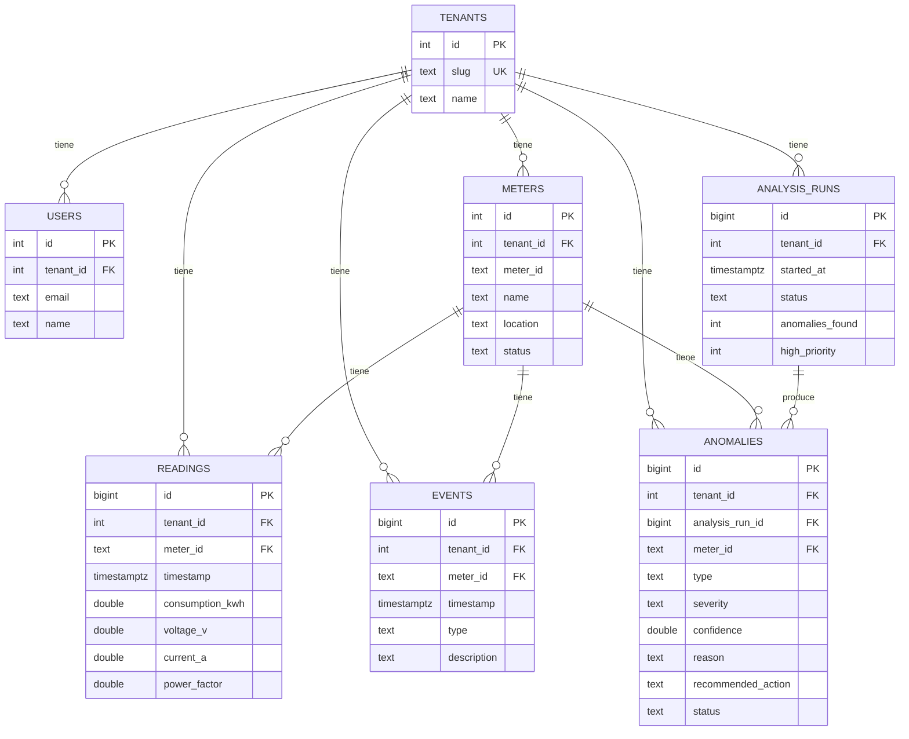

# AI Energy Management Platform

Plataforma para gestionar medidores eléctricos que usa IA para detectar,
explicar, priorizar y recomendar acciones sobre anomalías de consumo.

**URL front productivo:** https://frontend-production-6cbb.up.railway.app
(credenciales de acceso compartidas por correo)

## Cómo correr esto

Requisito único: tener Docker en ejecución.

```bash
git clone https://github.com/buba-0511/voltra.git
cd voltra
./run.sh local
```

Esto levanta el backend, el frontend y la base de datos, con el dataset
ya cargado. Una vez arriba:

1. Abrir **http://localhost:5173**
2. Iniciar sesión con las credenciales de la cuenta demo (compartidas por correo)
3. Recorrer Dashboard → Medidores → **M-109** → Anomalías IA →
   "Run AI Analysis" → Investigación de M-109

**Variables de entorno:**

| Variable         | Para qué sirve                                                   |
|------------------|--------------------------------------------------------------------|
| `PORT`           | Puerto del backend (default `8080`)                                |
| `DATABASE_DSN`   | Conexión a Postgres                                                 |
| `JWT_SECRET`     | Obligatoria — el servidor no arranca sin ella                      |
| `OPENAI_API_KEY` | Opcional — sin ella, las explicaciones se generan por plantilla    |

Con `./run.sh local` (Docker Compose), `OPENAI_API_KEY` se toma de un
`.env` en la raíz del repo (ver `.env.example`).

## Qué hace

El ciclo completo funciona de punta a punta contra datos reales: **datos
→ análisis → anomalía → explicación → priorización → acción.**

- Se cargan 12 medidores con 14 días de lecturas (consumo, voltaje,
  corriente, factor de potencia).
- Un motor estadístico calcula el comportamiento esperado de cada
  medidor y detecta cuándo se sale de lo normal.
- Cada anomalía se clasifica como real, explicable por un evento
  operativo conocido, falso positivo, o problema de calidad de datos —
  con severidad, nivel de confianza y una explicación en lenguaje
  natural generada a partir de la evidencia.
- Desde el dashboard se ve de inmediato qué medidor requiere atención y
  por qué, y se puede marcar una anomalía como revisada o descartarla.

Los cuatro casos de referencia del dataset (M-104, M-106, M-109, M-112)
fueron verificados contra el resultado real de correr el análisis, no
solo revisados a mano.

## Cómo se pensó esto

La detección de anomalías es puramente estadística (no depende de un
modelo de lenguaje), para que el resultado sea siempre el mismo ante los
mismos datos. La IA generativa se usa únicamente para redactar la
explicación y la recomendación en base a lo que el motor ya calculó —
nunca decide si algo es una anomalía. Si no hay una clave de IA
configurada, el sistema igual funciona con explicaciones basadas en
plantilla, para que una falla de red o de crédito nunca tumbe la demo.

Distinguir una falla de sensor de un cambio real de consumo no fue
trivial: el criterio que separa ambos casos es la continuidad del
comportamiento anómalo en el tiempo, no solo su magnitud.

El diseño de la base de datos ya contempla múltiples clientes (aunque
hoy la plataforma opera con uno solo), porque agregar eso después,
una vez que los datos ya están mezclados, es mucho más costoso que
incluirlo desde el inicio.

**Fuera de alcance, a propósito:** gestión de múltiples clientes desde
la interfaz, procesamiento en tiempo real (el análisis se corre bajo
demanda), y modelos de IA "caja negra" — la detección es explicable por
diseño.

## Estructura

```
.
├── backend/     # API y motor de análisis (Go)
├── frontend/    # aplicación web (React)
├── data/        # dataset provisto por la prueba
└── run.sh       # levanta todo en local
```

## Modelo de datos



## Deploy

Desplegado en Railway (Postgres + backend + frontend), con CI/CD — cada
push se valida automáticamente antes de salir a producción.
