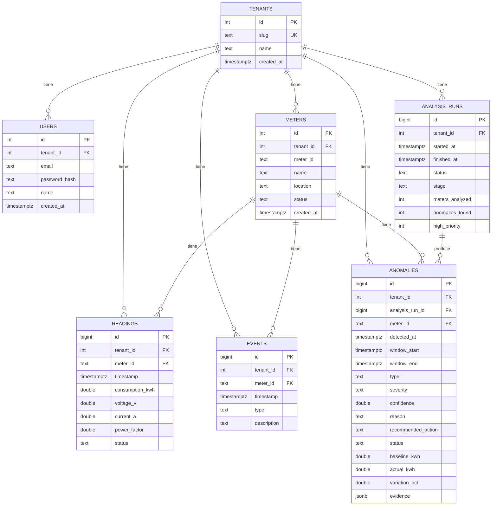

# AI Energy Management Platform

MVP para gestionar medidores eléctricos y usar IA (detección estadística +
explicación) para detectar, priorizar y recomendar acciones sobre anomalías.
Prueba técnica: Backend + Frontend + Data + IA.

## Cómo correr esto

Requisito: Docker corriendo. Nada más.

```bash
git clone <este repo>
cd bia-test
./run.sh local
```

Levanta backend (`:8080`), frontend (`:5173`) y Postgres, con el dataset
ya cargado. Cuando termine:

1. Abrí **http://localhost:5173**
2. Entrá con `admin@energy-platform.local` / `demo1234`
3. Dashboard → Medidores → click en **M-109** → Anomalías IA → "Run AI
   Analysis" → Investigación de M-109

Variables de entorno y más detalle en [Detalle de cómo correrlo](#detalle-de-cómo-correrlo).

## Estado actual

**El ciclo completo está funcionando de punta a punta**: Login →
Dashboard → Medidores → Detalle → Anomalías IA → Investigación → Acción,
todo contra datos reales.

- `backend/` — módulo Go (`energy-platform`), Postgres con `sqlc` (SQL
  explícito + código Go generado, sin ORM), migraciones para el schema
  completo del ERD, y un seed que carga `readings.csv`/`events.csv` al
  arrancar (idempotente). Login (`POST /auth/login`, `GET /auth/me`,
  `POST /auth/logout`) con JWT en cookie `httpOnly` (no en el body ni en
  localStorage). `GET /meters`, `/meters/:id`, `/meters/:id/readings`
  (paginado por cursor), `/meters/daily`, `/meters/:id/daily`,
  `/dashboard/summary`. Motor de detección + clasificación + explicación
  (`internal/analytics` + `internal/ai`), orquestado por
  `internal/anomalies` (análisis por medidor en paralelo, acotado) y
  expuesto en `POST /ai/analyze`, `GET /ai/analysis/:id`,
  `GET /anomalies`, `GET /anomalies/:id`, `PATCH /anomalies/:id` (marcar
  en revisión / descartar). Timeout por request, errores reales logueados
  server-side. `GET /health`. Corrido de punta a punta contra el dataset
  real: 12 medidores analizados, 4 anomalías detectadas, 2 de alta
  prioridad — coincide exacto con el ejemplo del enunciado (sección 13).
  Las explicaciones las escribió un LLM real (OpenAI), citando los
  números correctos.
- `frontend/` — Vite + React + TypeScript + Tailwind CSS v4. Redux
  Toolkit + RTK Query para estado/data-fetching, Axios por debajo
  (`withCredentials`, logout global en cualquier 401). Login funcional
  contra el backend real, rutas protegidas (`react-router-dom`), shell
  con sidebar en desktop y barra de navegación inferior en mobile. Marca
  propia ("Voltra"), paleta (`brand`/`ink`) y tipografía (Geist Sans)
  definidas como tokens de Tailwind v4. Gráficos con Recharts (línea de
  tiempo por medidor, comparación real vs baseline con la ventana de la
  anomalía resaltada, voltaje/factor de potencia). Dashboard, Medidores,
  Detalle de medidor, Anomalías IA (con el botón "Run AI Analysis") e
  Investigación (evidencia, variables que cambiaron, comparación vs
  baseline, acciones reales) usan datos reales de la API, no mock.
  `ErrorBoundary` global y estados de carga con skeletons en vez de texto
  plano.
- `data/` — `readings.csv` (4.032 lecturas, 12 medidores, 14 días) y
  `events.csv` (eventos operativos conocidos) provistos por la prueba.
- `docker-compose.local.yaml` + `run.sh` — levanta Postgres, backend y
  frontend en modo dev.

Los 4 casos que evalúa la prueba (M-104/106/109/112) están verificados
contra el resultado real de `POST /ai/analyze`, no solo revisados a ojo.

## Cómo se pensó esto

El objetivo no es un CRUD de medidores, es mostrar el ciclo completo: datos
→ análisis → anomalía → explicación → priorización → acción.

**Backend en Go + Postgres**, sin ORM. Uso `sqlc`: escribo el SQL a mano y
genera funciones Go tipadas — si una migración rompe una query, me entero
al generar el código, no en producción. `evidence` en `ANOMALIES` es JSONB
porque su forma cambia según el tipo de anomalía, sin modelar una tabla
nueva por cada caso.

**La IA está separada en dos capas que no se pisan.** Detección y
clasificación (¿hay anomalía?, de qué tipo, con qué confianza) es
puramente estadística — baseline por hora sobre los primeros 7 días,
z-score, chequeo de voltaje/PF — porque necesito que sea reproducible: los
casos que evalúa la prueba no pueden depender de que un LLM responda
distinto en cada corrida. El LLM (OpenAI) solo entra para redactar
`reason`/`recommended_action` a partir de la evidencia ya calculada — nunca
diagnostica. Si no hay `OPENAI_API_KEY` o falla la llamada, cae a un
template, así el demo no se rompe por red o costo (probado con un servidor
HTTP falso en los tests; hay un test aparte con build tag `live` que sí
pega contra OpenAI real).

Separar "falla de sensor" de "cambio real de consumo" no salió a la
primera — un z-score de voltaje/PF también disparaba para M-109, cuyo
power factor cae de verdad cuando sube el consumo. Lo que separa los dos
casos es la **continuidad**: M-109 es un bloque de 58 horas seguidas sin
huecos (cambio de estado sostenido); M-112 son 16 lecturas sueltas cada 3
horas exactas, alternando de signo (ruido de sensor). El motor agrupa
lecturas fuera de rango en bloques contiguos y decide por ahí, no por
magnitud sola — queda como test contra el CSV real en
`internal/analytics/detector_test.go`.

`POST /ai/analyze` corre síncrono — el motor estadístico es instantáneo
para 12 medidores, y las explicaciones por LLM salen en paralelo
(goroutines) en vez de una por una, así que la corrida completa tarda ~3s.
`GET /anomalies` solo devuelve las del último análisis corrido, no
acumula entre clicks.

**Frontend en React + Vite + Tailwind**, Redux Toolkit + RTK Query sobre
Axios. Nombre e identidad propia ("Voltra", paleta `brand`/`ink`, Geist
Sans) en vez de quedar genérico — el login se siente como el de un SaaS
real, sin mencionar que esto es una prueba técnica.

**Seguridad y escala, ya con el producto funcionando:** el JWT vive en una
cookie `httpOnly` (no en `localStorage`, no lo puede leer un script
inyectado) y el servidor no arranca si falta `JWT_SECRET`, en vez de caer
a un default silencioso. Con 12 medidores y 4.032 lecturas nada se nota,
pero `GET /meters` hacía una query de lecturas por medidor (N+1) y el
timeline de "todos los medidores" pedía las lecturas crudas de cada uno
por separado — los cambié por una sola query agregada en Postgres, y
`/meters/:id/readings` quedó paginado por cursor para no devolver una
respuesta sin límite si la frecuencia de datos aumenta.

Una que nadie pidió: le metí `tenant_id` a todas las tablas desde el
modelo de datos, aunque hoy opera con un único tenant seedeado. Separar
por tenant después de tener datos mezclados es una migración fea, y
hacerlo desde el día uno no cuesta nada.

**Lo que queda afuera, a propósito:**

- UI multi-tenant (alta/cambio de tenant) — el esquema lo soporta, el
  producto no lo expone.
- Tiempo real — el análisis se dispara a mano con "Run AI Analysis", no hay
  websockets ni polling agresivo.
- Modelos entrenados — la detección es estadística explicable, no una caja
  negra.
- Tests end-to-end o CI/CD — la cobertura se concentra en el motor de
  detección/clasificación, que es lo que evalúa la prueba.

## Modelo de datos



Todas las tablas cuelgan de `TENANTS` vía `tenant_id`, incluida `USERS`
(cada usuario pertenece a un tenant). `meter_id` es único por tenant
(`UNIQUE(tenant_id, meter_id)` en `METERS`), y `READINGS`/`EVENTS`/
`ANOMALIES` referencian al medidor por `(tenant_id, meter_id)` para que un
`tenant_id` inconsistente entre una lectura y su medidor sea imposible a
nivel de base de datos. `evidence` en `ANOMALIES` es JSONB porque su forma
varía según el tipo de anomalía (z-scores, voltaje/PF baseline vs actual,
evento relacionado, timestamps flageados) — alimenta la pantalla de
Investigación sin modelar una tabla nueva por cada tipo de evidencia.

## Estructura

```
.
├── backend/                 # Go
│   ├── cmd/server/main.go
│   ├── internal/
│   │   ├── ai/              # clasificación por reglas + explicación (template/OpenAI)
│   │   ├── analytics/       # baseline por hora, z-score, calidad de datos
│   │   ├── anomalies/       # orquesta analytics+ai, /ai/analyze, /ai/analysis/:id, /anomalies
│   │   ├── auth/            # password hashing, JWT en cookie httpOnly, /auth/login, /auth/me, /auth/logout
│   │   ├── config/
│   │   ├── db/
│   │   │   ├── migrations/  # SQL crudo, fuente de verdad del schema
│   │   │   ├── queries/     # .sql que lee sqlc
│   │   │   └── sqlc/        # código Go generado (comiteado)
│   │   ├── dashboard/       # GET /dashboard/summary
│   │   ├── httpx/           # helpers HTTP compartidos (JSON, formato de fecha)
│   │   ├── httpserver/      # router + CORS, arma todas las rutas
│   │   ├── meters/          # GET /meters, /meters/:id, /meters/:id/readings (paginado), /meters/daily
│   │   └── seed/            # tenant + usuario demo + carga de readings/events.csv
│   ├── sqlc.yaml
│   ├── Dockerfile
│   └── go.mod
├── frontend/                 # Vite + React + TS + Tailwind
│   ├── src/
│   │   ├── api/              # axios + interceptors, RTK Query (apiSlice.ts)
│   │   ├── auth/              # ProtectedRoute (guard de rutas)
│   │   ├── components/       # TimeSeriesChart (Recharts), StatTile, Badge, Skeleton, ErrorBoundary
│   │   ├── layout/            # shell con sidebar (desktop) / nav inferior (mobile) + logout
│   │   ├── pages/              # Login, Dashboard, Medidores, Detalle, Anomalías, Investigación
│   │   └── store/              # Redux: authSlice + store.ts
│   └── Dockerfile
├── data/
│   ├── readings.csv
│   └── events.csv
├── docker-compose.local.yaml
└── run.sh
```

## Detalle de cómo correrlo

```bash
./run.sh local
```

Esto levanta:

- **backend** — Go, `go run ./cmd/server`, puerto `8080` (`GET /health`)
- **frontend** — Vite dev server, puerto `5173`
- **db** — Postgres 16, puerto host `5433` (usuario/clave/db: `app`/`app`/`energy`)

## Variables de entorno (backend)

| Variable        | Default                                                    |
|-----------------|-------------------------------------------------------------|
| `PORT`          | `8080`                                                       |
| `DATABASE_DSN`  | `postgres://app:app@db:5432/energy?sslmode=disable` (en Docker) |
| `DATA_DIR`      | `../data` — carpeta con `readings.csv`/`events.csv` para el seed |
| `JWT_SECRET`    | **sin default** — el servidor no arranca sin esta variable seteada |
| `OPENAI_API_KEY` | (sin default) — si no está seteada, las explicaciones de anomalías caen a template en vez de LLM |

**Usuario demo seedeado:** `admin@energy-platform.local` / `demo1234`
(un solo tenant, un solo usuario — ver [Alcance de diseño](#cómo-se-pensó-esto)).

**Probar el explainer de OpenAI contra la API real** (no corre en
`go test ./...` normal, hay que pedirlo explícitamente para no gastar
créditos en cada corrida):

```bash
cd backend
echo "OPENAI_API_KEY=sk-..." > .env.local   # gitignored
go test ./internal/ai/... -tags=live -run TestLive_OpenAIExplainer_RealCall -v
```
